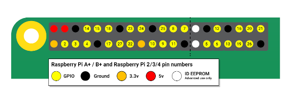

# RaspberryPi GPIO plugin

Collect metrics from the GPIO pins on a RaspberryPi

This plugin using the [go-rpio](https://github.com/stianeikeland/go-rpio) library to read values from the GPIO pins.

## Configuration

### Example
```
# Reads binary values from the GPIO pins of a RaspberryPi
[[inputs.rpi_gpio]]

  ## Provide a data field name to gpio pin numbers
  ## Numbers correspond to the GPIO number, not the physical pin number
  [inputs.rpi_gpio.pins]
  button = 2
  motion_sensor = 3
  light_sensor = 4
  ```

You must to create a named field for each pin you want to read data from. The pin number corresponds to the GPIO number as indicated on the image below.



## Measurements & Fields

The measurement name will always be `gpio`. 

Field names are those defined in the `[inputs.rpi_gpio_pins]` section of the configuration. Readings will only be sent from pins defined in this section.

Values will always be either `0` (indicating LOW voltage on the pin) or `1` (indicating HIGH voltage)

## Example Output

```
telegraf --config telegraf.conf --input-filter rpi_gpio --test
2020-03-02T20:45:53Z I! Starting Telegraf 
> gpio,host=raspberrypi button=1i,light_sensor=1i,motion_sensor=0i 1583181953000000000
```