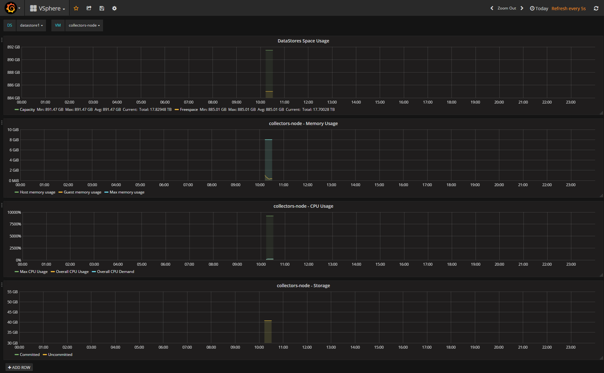

# Telegraf Input Plugin: VSphere

This plugin gather datastores & vms metrics using VSphere Remote API.

It collect the following metrics:

- VMs CPU usage
- VMs Memory usage
- VMs Storage Usage
- VMs Healthstatus
- VMs count (Running, stopped, total)
- Datastores space usage
- ...

### Configuration:

```toml
# Description
[[inputs.vsphere]]
    ## FQDN or an IP of a vSphere Server or ESX system
    server = ""
    ## A ESX/Vsphere user with System.View and Performance.ModifyIntervals privileges
    username = ""
    ## Password for the above user
    password = ""
    ## When using self-signed certificates set this option to true
    insecure =  true
```

### Measurements & Fields:

Every effort was made to preserve the names based on the JSON response from the VSphere API.

- vm_metrics:
    - mem_mb
    - num_cpu
    - host_mem_usage
    - guest_mem_usage
    - overall_cpu_usage
    - overall_cpu_demand
    - swap_mem
    - uptime_sec
    - storage_committed
    - storage_uncommitted
    - max_cpu_usage
    - max_mem_usage
    - num_cores_per_socket
  - ds_metrics:
    - capacity
    - freespace

### Tags:

- vm_metrics:
    - name
    - guest_full_name
    - connection_state
    - vm_path_name
    - ip_address
    - hostname
    - guest_id
    - is_guest_tools_running
  - ds_metrics:
    - name
    - type
    - url

### Sample Queries:

```
SELECT mean("host_mem_usage") FROM "vm_metrics" WHERE "name" =~ /^$VM$/ AND $timeFilter GROUP BY time($interval) fill(null) // Memory used
SELECT mean("max_mem_usage") FROM "vm_metrics" WHERE "name" =~ /^$VM$/ AND $timeFilter GROUP BY time($interval) fill(null) // Max memory
```

<p align="center">
  
</p>

### Example Output:

```
$ ./telegraf -config telegraf.conf -input-filter vsphere -test
ds_metrics,name=datastore1,type=VMFS,url=ds:///vmfs/volumes/565329ae-e9216057-0425-0cc47a6b4d7e/,host=f4a171794478 capacity=891474149376i,freespace=885013872640i 1492503065000000000
vm_metrics,guest_id=ubuntu64Guest,guest_full_name=Ubuntu\ Linux\ (64-bit),overall_status=green,vm_path_name=[vsanDatastore]\ fa489858-d6e5-e81d-12ee-0cc47a6b5d06/vm-test.vmx,host=f4a171794478,name=vm-test,connection_state=connected,is_guest_tools_running=guestToolsNotRunning host_mem_usage=0i,guest_mem_usage=0i,storage_committed=3626449963i,max_cpu_usage=4598i,max_mem_usage=1024i,num_cores_per_socket=1i,storage_uncommitted=6209339392i,mem_mb=1024i,num_cpu=2i,overall_cpu_usage=0i,overall_cpu_demand=0i,swap_mem=0i,uptime_sec=0i 1492503067000000000
```
