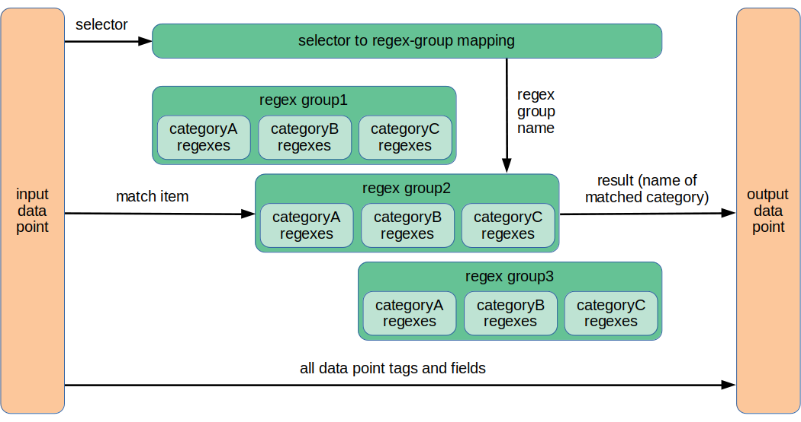

# Classify Processor Plugin

The `classify` plugin makes decisions based on comparison of designated
string tag and field values against groups of regular-expression patterns.
The result of those decisions is either that an input data point is
dropped, or a new tag or field is created showing the classification
of the input data.  The original input data is always left undisturbed;
no replacement substitutions are carried out by the regular expression
matching.

While performing input data classification, the `classify` plugin
supports limited transient internal tag/field value mapping.
This allows consolidation of duplicate sets of regular expressions in
the configuration.  The original tag/field value is left undisturbed,
and the mapped value does not appear in the plugin output.

The tag/field mapping is included in the `classify` plugin because
otherwise one would need to invoke the `enum` plugin beforehand to
perform value mapping, and the `fielddrop` or `tagexclude` option would
need to be applied to the `classify` plugin to strip out the mapped
values needed only on a transient basis for the classification logic.
The extra parsing and re-serialization of the data that would be invoked
by using the `enum` plugin in the pipeline seems like pointless overhead.

In addition to those actions, the `classify` plugin supports accumulation
of classification statistics and periodic output of those statistics.
In this sense, the plugin acts as an aggregator, but only appending extra
data to the stream without altering the output of classification results.

The statistics aggregation is included in the `classify` plugin because
of the following bug in Telegraf 1.x:

> aggregators should not re-run processors
[#7993](https://github.com/influxdata/telegraf/issues/7993)

That issue is slated to be addressed in Telegraf 2.0, but there is no
timeline for its release.  In the meantime, we don't want the `classify`
plugin to be invoked a second time after classification statistics
are collected.

## Motivation

The text below describes the processing model in some detail, which
upon initial reading may be a bit confusing.  It may help to know that
this plugin was developed in support of processing syslog messages from
multiple hosts that may or may not share the same computational purpose
and therefore may or may not generate the same types of syslog messages.
We want to support commonality of configuration where that is appropriate,
while allowing distinct configuration where that is needed.  Hence there
is a bit of indirection at the beginning of the processing stream, to
identify the kind of regular expressions to be applied to a given input
data point.

Beyond that initial identification, we wanted to be able to recognize
a variety of different messages that might appear from a given source,
classifying them into just a few result categories.  So the overall
logical structure of the regular expressions that can be configured is:

```markdown
regex_group_name
    category_name
        regex
        regex
        regex
    category_name
        regex
        regex
regex_group_name
    category_name
        regex
        regex
        regex
    category_name
        regex
        regex
```

with as many items at each level of the hierarchy (`regex_group_name`,
`category_name`, `regex`) as needed.  To that end, we wanted to make
the specification of that hierarchy as compact as possible in the config
file, so the administrator does not get lost in the surrounding syntax
and can concentrate on the task at hand.

Given this model of processing, it seemed sensible to implement it in a
general way, not specifically tied to syslog messages.  So the abstract
model of processing is couched in other terms, in the hope that this
plugin may find use in other contexts.  The sample setup shown at the
end of [CONFIGURATION.md](CONFIGURATION.md) may help to clarify actual
practical application of this plugin.

## Comparison to the `regex` processor

* An initial calculation is run to dynamically select amongst multiple
sets of regular expressions.
* Groups of related regular expressions are easier to specify, instead
of one-at-a-time setup.
* A single tag or field is created, representing the result of the
classification.
* No tags or fields are overwritten, unless the configured result
tag/field is already present in the incoming data.
* Aggregate processing statistics are emitted on a regular basis,
separate from passing through or dropping classified data points.

## Abstract processing model

Here is a top-level view of how this plugin works, showing its essential
simplicity.



The processing steps are:

1. Identify a selector item (tag or field), to discriminate between
possible groups of regular expressions that might be applied to an input
data point.

1. Map the selector item's value to the name of a group of sets of
regular expressions to match against an input data point.

1. Identify a match item (tag or field) that is to be matched against
the regular expressions chosen by the mapped selector item's value.

1. Identify a result item (tag or field) that is to be added to the data
point and contain the classification result.

1. Step through each set ("category") of regular expressions in the
selected group of such sets, matching each regular expression in turn
against the match item's value.  The first match that succeeds determines
the final classification.  The result value will be the name of the
category that the matching regex belongs to.

### Simplified pseudo-code

_At plugin startup:_

* analyze the configuration
* create some corresponding aggregation counters (others will depend
on details of the input data points, and be dynamically created as data
is processed)
* set all those counters to zero
* initialize the required thread-synchronization objects
* start the aggregation thread
* start the processing thread

_Processing thread, executed once for each input data point:_

```markdown
read data point
regex_group_name = {map selector value}
foreach regex_category in regexes[regex_group_name] {
    foreach regex in regexes[regex_group_name][regex_category] {
        if match_item matches regex {
            result = regex_category
            add result to this data point
            update aggregation statistics (if configured), in a
                manner synchronized with the aggregation thread
            exit all loops for matching this data point
        }
    }
}
write out this data point
```

_Aggregation thread, operating as a background task, at the end of each
configured period:_

* synchronize access to the aggregration counters with the processing
thread to prevent race conditions
* spill out measurements containing all of the configured aggregation
counters
* zero out all the aggregation counters

_At plugin shutdown:_

* synchronize access to the aggregration counters with the processing
thread to prevent race conditions
* spill out all aggregation counts collected since the last spill action
* zero out all the aggregation counters (pro forma)

## Aggregated classification statistics

Aggregation statistics are an invention of this plugin, meaning the
details of their construction must be specified by the configuration
so these measurements have a form which is acceptable to whatever
output plugin(s) you use.  As part of that setup, the configuration must
specify the measurement name as the principal component of the aggregated
statistics, since it might be different from the measurement name used
by the input data points.

There are three types of aggregation-statistics output that can be
produced, depending on how you configure this plugin.  For any of
these types, if all of the fields to be reported in a given individual
aggregation-data point are zero, that data point will be suppressed.

* Full-volume ("summary") statistics, not sliced into smaller portions.
Nominally, there can be one such aggregated-data point emitted at the
end of each aggregation period.

* Per-regex-group statistics.  Nominally, there can be one such
aggregated-data point emitted at the end of each aggregation period for
each regex group that was mapped to during that period.

* Per-selector-value statistics.  Nominally, there can be one such
aggregated-data point emitted at the end of each aggregation period for
each distinct selector value that was seen during that period.

The specific tag names used for the aggregation-data points are
configurable, as are the sets of fields included in such data points,
to adapt to your local needs.

An example might help to show the utility of such constructions.
Suppose the selector is the hostname from a syslog message, and the
category represents the level of severity of that message (ignore, ok,
warning, critical, unknown).  The grouping might use the hostname to
identify the nature of the host (firewall node, compute node, network
switch, database machine, file server, etc.), and apply regexes tailored
to that type of host.  With those ideas in mind, we implement the sample
configuration shown later in this document.

Let's show what the aggregated-data output would look like, using a
simple example.  Suppose we have five hosts:

* `fire123`, a firewall node
* `ora456`, an Oracle database node
* `pg789`, a PostgreSQL database node
* `rout237`, a router
* `rout846`, a router

Let us further suppose we map hostnames into host-types as the regex group
names.  For purposes of this mapping, we assume that all the routers are
running the same software, so the nature of their syslog messages will be
the same and the matching of those messages need only be configured once.
Also, for didactic purposes, two different kinds of databases are folded
into the same group.  In practice, that would only be useful if either we
had an unspecified abstraction layer running on both of those machines
to map database-type-specific messages into some common format, or we
simply combined all of the regexes for either type of database into the
one group of regexes configured in this plugin for such machines.

* `fire123` => `firewall`
* `ora456` => `database`
* `pg789` => `database`
* `rout237` => `router`
* `rout846` => `router`

In addition, let's suppose we have the following regex categories:

* `ignore`, for messages that should be dropped (but counted in this
match category in aggregation statistics; see the `drop_categories`
configuration option)
* `okay`, for messages that represent an operating-normally state
* `warning`, for messages indicating conditions of possible concern
* `critical`, for messages indicating conditions of definite concern
* `unknown`, for messages that we have not yet analyzed enough to develop
specific regexes to match and otherwise classify

For the example aggregated-data output shown just below, we
have the following options in play, along with definitions of
`aggregation_summary_fields`, `aggregation_group_fields`,
and `aggregation_selector_fields` not shown here.  The
`aggregation_includes_zeroes` option is enabled here for didactic
purposes, so you can see all the aggregation-point category fields
involved; most commonly, that would be left disabled.

```toml
aggregation_measurement     = 'status'
aggregation_summary_tag     = 'summary'
aggregation_summary_value   = 'full'
aggregation_dropped_field   = 'dropped'
aggregation_total_field     = 'total'
aggregation_group_tag       = 'host_type'
aggregation_selector_tag    = 'host'
aggregation_includes_zeroes = true
```

With all of that (and a bit more) in play, the available aggregation
counts might represent answers to the following kinds of questions.
We show the corresponding output for this example setup in InfluxDB
Line Protocol format.  Recall that said format names the measurement,
concatenated directly with all the (optional) tag data, followed by
all the field data, followed by an optional timestamp (which we do not
show here).

_What is the total volume of messages across my infrastructure?_

```markdown
## Show the overall distribution of classification states and plugin
## activity.  Bin the counts of data points reported here by {category}
## only, without discriminating by {group} or {selector}.
status,summary=full ignore=5,okay=3,warning=8,critical=2,unknown=1,dropped=5,total=19
```

_What kinds of machines/devices are generating lots of messages I might
care about?_

```markdown
## Show a coarse distribution of incoming data, based on the mapping
## of {selector} values to {group} values.  Bin the counts reported
## here by {group} and {category} only, ignoring the particular
## {selector} values involved.  For this example, we have chosen to
## report only known problem states and the total activity for each
## kind of host.
# aggregation_group_fields = [ 'warning', 'critical', 'total' ]
status,host_type=firewall warning=2,critical=1,total=4
status,host_type=database warning=5,critical=0,total=8
status,host_type=router warning=1,critical=1,total=7
```

_What kinds of services in my infrastructure are in good or bad shape?_

```markdown
## Show a coarse distribution of incoming data, based on the mapping
## of {selector} values to {group} values.  Bin the counts reported
## here by {group} and {category} only, ignoring the particular
## {selector} values involved.  For this example, we have chosen to
## report the full set of calculated {category} states and nothing
## else, because that is all we care to graph.
# aggregation_group_fields = [
#   'ignore', 'okay', 'warning', 'critical', 'unknown'
# ]
status,host_type=firewall ignore=0,okay=1,warning=2,critical=1,unknown=0
status,host_type=database ignore=1,okay=2,warning=5,critical=0,unknown=0
status,host_type=router ignore=4,okay=0,warning=1,critical=1,unknown=1
```

_What is the bird's-eye view of how my infrastructure is running?_

```markdown
## Show a coarse distribution of incoming data, based on the mapping
## of {selector} values to {group} values.  Bin the counts reported
## here by {group} and {category} only.  For this example, we not only
## collect the data needed for later per-service-type reporting, we
## also include total-traffic counts, because the NOC manager watches
## those numbers in a dashboard as a proxy for overall trouble to see
## if he needs to call in extra help for particular kinds of services.
# aggregation_group_fields = [
#   'ignore', 'okay', 'warning', 'critical', 'unknown', 'total'
# ]
status,host_type=firewall ignore=0,okay=1,warning=2,critical=1,unknown=0,total=4
status,host_type=database ignore=1,okay=2,warning=5,critical=0,unknown=0,total=8
status,host_type=router ignore=4,okay=0,warning=1,critical=1,unknown=1,total=7
```

_What particular machines are generating lots of messages, regardless
of severity?_

```markdown
## Show just the volume of incoming data across selector values,
## regardless of utility or classification.  This might be useful,
## for instance, if we have set up upstream filtering so only
## serious-state messages are forwarded to where the Telegraf plugin
## sees them, and all we need to graph is the total traffic for each
## host.  There would be no need to waste resources by generating
## and storing other categories of counts.
# aggregation_selector_fields = [ 'total' ]
status,host=fire123 total=4
status,host=ora456 total=2
status,host=pg789 total=6
status,host=rout237 total=7
```

_What were the overall states of particular machines during each
reporting period?_

```markdown
## Show detailed counts of classifications on a per-selector-value basis.
## Bin the counts by the combination of {selector} and {category}.  We
## don't care about the other available data (dropped-data-point and
## total-data-point counts), because with the full set of category counts,
## we will have all the information we need to act upon for everyday
## system administration and troubleshooting.
# aggregation_selector_fields = [
#   'ignore', 'okay', 'warning', 'critical', 'unknown'
# ]
status,host=fire123 ignore=0,okay=1,warning=2,critical=1,unknown=0
status,host=ora456 ignore=0,okay=1,warning=1,critical=0,unknown=0
status,host=pg789 ignore=1,okay=1,warning=4,critical=0,unknown=0
status,host=rout237 ignore=4,okay=0,warning=1,critical=1,unknown=1
```

_How healthy are my servers, in the eyes of everyone who cares in one
way or another?_

```markdown
## Show detailed counts of classifications on a per-selector-value basis,
## and also capture the total-traffic count for each host.  The latter
## will be used not for the NOC operators, but for a management report to
## direct attention to equipment that may need to be upgraded or replaced.
# aggregation_selector_fields = [
#   'ignore', 'okay', 'warning', 'critical', 'unknown', 'total'
# ]
status,host=fire123 ignore=0,okay=1,warning=2,critical=1,unknown=0,total=4
status,host=ora456 ignore=0,okay=1,warning=1,critical=0,unknown=0,total=2
status,host=pg789 ignore=1,okay=1,warning=4,critical=0,unknown=0,total=6
status,host=rout237 ignore=4,okay=0,warning=1,critical=1,unknown=1,total=7
```

Which of these statistics need to be aggregated and output depends on
your own use case, so this work is all configurable.  Each kind of
statistic can be individually enabled by configuration.  If none of
them are enabled, no aggregation counting will occur and no aggregated
measurements will be generated.

Notice that no aggregation output appeared for host `rout846`.  That's
because it sent no messages during this period.  The aggregation does not
manufacture and send out total=0 or equivalent data points in this case.
That has an effect on how you set up valid graphing for aggregation data.
(You shouldn't be connecting successive available non-zero data points
with lines, as that would be misleading.  If your graphing tool has the
ability to treat missing values in a graph interval as zero values,
then you could reasonably connect successive data points with lines.
Beyond such simple advice, the topic of metric graphing is outside the
scope of this plugin documentation.)

## Configuration

```toml @sample.conf
# Classify Telegraf data points according to user-specified rules.
[[processors.classify]]
  ## The detailed configuration data for the classify plugin lives
  ## in a separate file, whose path is given here.
  classify_config_file = '/etc/telegraf/telegraf.d/classify.toml'
```

The `classify` plugin needs complex data for its configuration,
including TOML literal strings as hash keys and arrays of hashes.
However, the Telegraf 1.x TOML parser is limited in its functionality
and does not support the full TOML v1.0.0 specification.  Hopefully,
that will be addressed in Telegraf 2.0.  In the meantime, we are forced
to move the configuration for this plugin out to a separate file, and
we leave behind only a single plugin-specific option to be processed by
the Telegraf-internal parser.

At the point where Telegraf itself is able to parse full TOML v1.0.0,
this config option will be deprecated, and the standard recommended
setup will have the plugin configuration in the usual location.

See [CONFIGURATION.md](CONFIGURATION.md) for detailed description of
configuration options.

## Bugs

The built-in TOML parser in Telegraf 1.x was written some time ago and
does not handle the full syntax of TOML v1.0.0.  We are therefore forced
to invoke a separate TOML parser from within the plugin to provide support
for a compact and readable configuration.  Hopefully this situation will
be fixed in Telegraf 2.0, where we would expect Telegraf to adopt the
github.com/BurntSushi/toml package for TOML parsing, as the `classify`
plugin has currently done.

The config-file formatting is complex, both because the underlying
structure of the data to be represented is complex, and because of
limitations in the TOML config-file format (and its parsers) used
by Telegraf.  (See [toml.io/en/v1.0.0](https://toml.io/en/v1.0.0) for
the TOML specification.)  In particular, we would like the as-listed
ordering of hash keys in a single key/value table to be accessible after
parsing the config file, in addition to by-key lookups within the table.
Both forms of access to the keys are important, but we are not allowed
to quash an array of tables into a single table (thereby also avoiding
potential duplicate keys) and retain numerically-indexed access to
the keys.  This idea may blow your mind because you have been trained to
think only in terms of simple arrays and simple random-iteration-order
hashes as separate data structures (and never the twain shall meet,
except for nesting).  If that is the case, take a look at the Boost
Multi-index Containers Library:

  [www.boost.org/doc/libs/1_79_0/libs/multi_index/doc/index.html](
    https://www.boost.org/doc/libs/1_79_0/libs/multi_index/doc/index.html)

The following package seems to be an implementation of the concept for
Go, though it's hard to tell because as of this writing the package is
not well-documented:

  [pkg.go.dev/github.com/eosspark/geos/libraries/multiindex](
    https://pkg.go.dev/github.com/eosspark/geos/libraries/multiindex)

We should describe how to run this plugin in a mode that simply verifies
that a sane configuration has been supplied, without attempting to
process any data points.

We should describe how to run this plugin in a mode that logs its internal
decisions, and tell users where to find the log, so users can debug the
behavior of misconfigured setups.

There should be a means to control the level of logging detail, to allow
finer granularity of logging while debugging a configuration and coarser
granularity during production use of the plugin.

## Possible future features

* Extend the model to support multiple independent classifications,
possibly chained.  Chaining would mean that the `result_tag` or
`result_field` would be used as the `selector_tag` or `selector_field`
for a subsequent classification.  Supporting multiple independent
classifications would also mean adding another option to tell whether
each intermediate result in a chained classification would be output
as well as the final classification in that chain.  These ideas await
a definitively useful use case.
